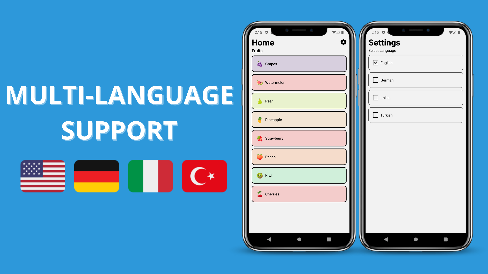

## How to Offer Multi-language Support in React Native?


### 📖Read blog post about the video
https://reactnativespace.com/tutorials/how-to-offer-multi-language-support-in-react-native

### 📘 Installation
Clone the repo to your directory and install the packages through npm using:
```
npm install
```

### 🔬 Run
Run the project with Metro Bundler
```
npx expo start
```

### 👇 Follow me;
- https://reactnativespace.com
- https://github.com/reactnativespace
- https://twitter.com/reactnativespc
- https://instagram.com/reactnativespace
- https://www.tiktok.com/@reactnativespace
